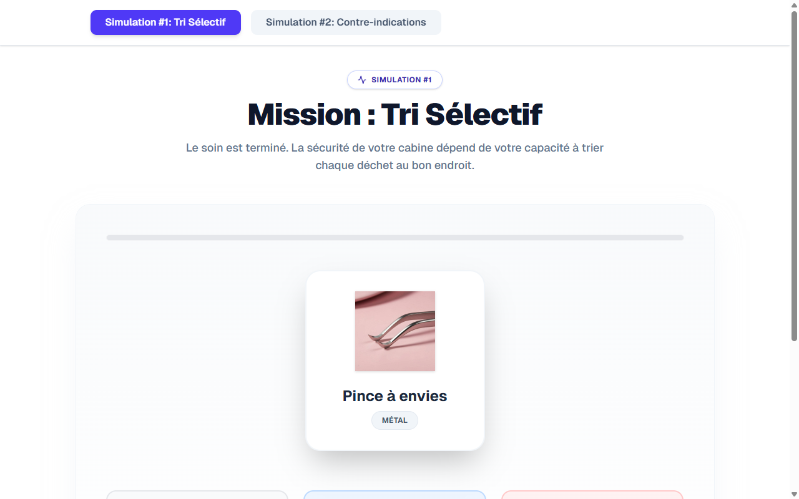

# Estheticienne — Plus qu'un Metier Slide 6

**Course:** Estheticienne plus qu'un metier  
**Slide:** 6  
**Live URL:** https://zolus.edtechiecorp.com  
**Stack:** Next.js · Tailwind CSS · TypeScript · GitHub Pages  

## What this slide does

Career-focused slide exploring the broader identity and professional significance of working as an aesthetician. At slide 6, the course moves beyond technical content to discuss the soft skills, entrepreneurial mindset, and personal satisfaction that come with the profession. This slide helps learners connect emotionally with their career path and understand the full scope of what it means to build a beauty business.

## Screenshot

## Usage

This slide is embedded as an iframe inside Coassemble at the live URL above. DNS is managed via Cloudflare (`edtechiecorp.com`). To update the slide, push to the `main` branch — GitHub Actions will rebuild and redeploy automatically.
